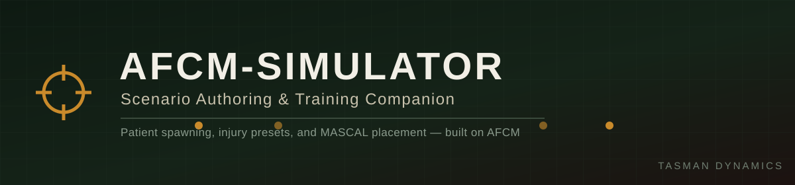

---

**A Tasman Dynamics High-Fidelity Simulation Project**

AFCM-Simulator is the scenario-authoring and training companion for [AFCM](https://github.com/A3-TasmanDynamics/AFCM)
(Australian First Combat Medicine). Where AFCM is the physiology engine, AFCM-Simulator is the
tool instructors and mission makers use to actually put it to work: build a casualty, spawn it
into the world, and run a scenario against it — one patient at a time or a full mass-casualty
drill.

---

## 🩹 What It Does

| Feature | What it means |
|---|---|
| 🧍 **Selectable Body Limbs** | Clickable limb diagram to target where a casualty is hurt |
| 🩸 **Selectable Injuries** | Wound type, severity, bleed state, and custom variables per limb |
| 📋 **Injury Presets** | Built-in (GSW, HE frag, blast lung) and user-saved, exportable/shareable presets |
| 🎲 **Injury Levels** | Five randomization profiles — Easy → Medium → Hard → Extreme → **F\*CKED!** |
| 🧑 **Random Patient** | One action: randomized identity, loadout, and injury set |
| 🛏️ **Stretcher Placement** | Selectable stretcher type, surface-snapped ghost-preview placement |
| 🗺️ **Map to Spawn Patients** | Click-to-place patients on the map, including MASCAL batch placement |

*Every path above funnels through one application pipeline — manual, preset, or randomized — so
presets and the randomizer produce exactly what a medic could also build by hand.*

## 🔗 How It Relates to AFCM

AFCM-Simulator is **standalone** — it doesn't depend on Tasman-Dynamics-Core, and owns its own
native-dialog UI kit rather than sharing one. AFCM itself is a **soft dependency**: if it's
loaded, AFCM-Simulator uses its native `PatientState` API. If it's not, and
[ACE3](https://github.com/acemod/ACE3) (optionally with
[KAT - Advanced Medical](https://steamcommunity.com/workshop/filedetails/?id=2020940806) or
[ACM](https://steamcommunity.com/sharedfiles/filedetails/?id=3235483358)) is loaded instead,
AFCM-Simulator runs against that. Both are genuinely optional Workshop dependencies — pick either,
or run both and AFCM wins. See [DESIGN.md §2.5](docs/DESIGN.md#25-soft-dependencies--runtime-backend-detection)
for how the detection actually works.

## 🧾 Requirements

| Dependency | Status |
|---|---|
| [Community Base Addons (CBA_A3)](https://github.com/CBATeam/CBA_A3) | Required |
| [AFCM](https://github.com/A3-TasmanDynamics/AFCM) | Soft — enables the native physiology backend |
| [ACE3](https://github.com/acemod/ACE3) | Soft — required for the compat backend |
| [KAT - Advanced Medical](https://steamcommunity.com/workshop/filedetails/?id=2020940806) | Soft — enhances the compat backend if present alongside ACE3 |
| [ACM (Advanced Combat Medicine)](https://steamcommunity.com/sharedfiles/filedetails/?id=3235483358) | Soft — alternative compat-backend enhancement alongside ACE3 |

> **At least one medical backend must be present** — AFCM, or ACE3 (optionally with KAT/ACM) — or
> AFCM-Simulator has nothing to apply injuries to. Run with just ACE3 + KAT and skip AFCM entirely
> if that's all you want; AFCM-Simulator detects what's actually loaded at mission start and picks
> the best available backend automatically (AFCM native path preferred when present). See
> [DESIGN.md §2.5](docs/DESIGN.md#25-soft-dependencies--runtime-backend-detection) for how.

## 📚 Documentation

| Doc | What's in it |
|---|---|
| [DESIGN.md](docs/DESIGN.md) | UI architecture decision, data model, MP authority, repo layout, phased roadmap |
| [AFCM/TERMINOLOGY.md](https://github.com/A3-TasmanDynamics/AFCM/blob/main/docs/TERMINOLOGY.md) | Shared glossary — clinical, tactical-medicine, and radio-callings terminology |

## 🗺️ Status

**Design phase.** Planned build order (full detail in [DESIGN.md §9](docs/DESIGN.md#9-phased-roadmap)):

`v1` Native-dialog UI + manual limb/injury selection against AFCM's native API →
`v2` Presets + randomization levels + Random Patient + stretcher placement →
`v3` Map spawn tool + MASCAL batch placement + preset sharing

## 📜 License

Released under the [Arma Public License Share Alike (APL-SA)](https://www.bohemia.net/community/licenses/arma-public-license-share-alike).

---

Part of the [AFCM](https://github.com/A3-TasmanDynamics/AFCM) project family. [Join the Tasman Dynamics Discord](https://discord.gg/Wt4ahmxVrs).

